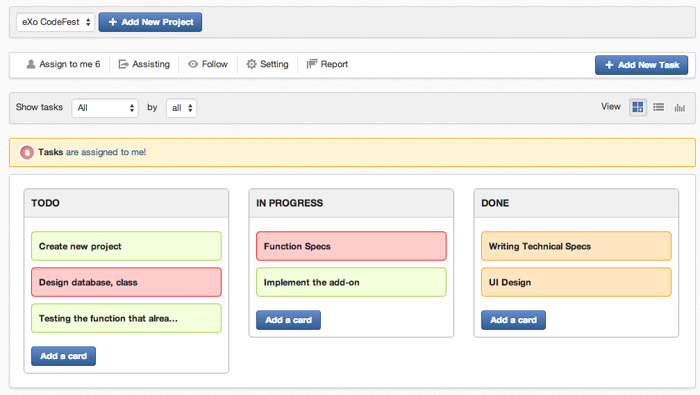

Codefest 2014 team C repository
===========

# The team C

TEAM MEMBER | EXO TEAM
------------ | ------------- 
Phung Hai Nam | CWI
Do Thanh Tung | CWI
Nguyen Thanh Trung | UI
Vu Tuan Anh | CWI

# Description 

- Name: <b>Tasks and Projects Management Add-on</b>

- The Tasks page helps view and manage the tasks an user is assigned to perform. Users can manage their tasks <b>across spaces, groups, projects</b>.

- Task progress and project status will be notified to <b>follower</b> and <b>published on Activity Stream</b> to others can follow what they are working on.

# Features

<table>
<tr><td>No</td><td>Features Name</td><td>Current Status</td></tr>
<tr><td>1</td><td>Create a new project, manage task by projects</td><td style="text-align: center;"></td></tr>
<tr><td>2</td><td>Create a new task</td><td style="text-align: center;"></td></tr>
<tr><td>3</td><td>Support 3 views: list views, status view, grantt view</td><td style="text-align: center;"></td></tr>
<tr><td>4</td><td>Drag & drop to update task status in status view</td><td style="text-align: center;"></td></tr>
<tr><td>4</td><td>View task detail info</td><td style="text-align: center;"></td></tr>
<tr><td>5</td><td>Tasks filter - filter by status, filter by me...</td><td style="text-align: center;"></td></tr>
<tr><td>5</td><td>Follower - who can follow the task status (assignee updates task will be sent to follower)</td><td style="text-align: center;"></td></tr>
<tr><td>5</td><td>Tasks Setting - personal configuration</td><td style="text-align: center;"></td></tr>
<tr><td>5</td><td>Task report - graphic report, rate of todo, in-progress, done... that will easy follow by manager (follower)</td><td style="text-align: center;"></td></tr>
<tr><td>6</td><td>Sharing task's activities on Activity Stream</td><td style="text-align: center;"></td></tr>
</table>

#### Usages:

- Open Tasks page on the left menu.

- Choose a project (create a new one in case there is no project existed)

- View tasks by 3 supported views: List View, Icon View, Grantt View

#### Default View

- In this view you can drag and drop task to update it's status
- Click on "Add a card" button to add new task. If you create it in TODO column then it will be set as TODO...

* List View

- Click on Task to view it in detail

#### Grantt View

- With this view you can view all task visually 

#### Create a new task 

- Click on "Add new Task" button on the right or directly in collumn in default view. It will show a popup to create a new task.

#### View Task's detail

- In List View when you click on Task -> task detail will open in Popup

